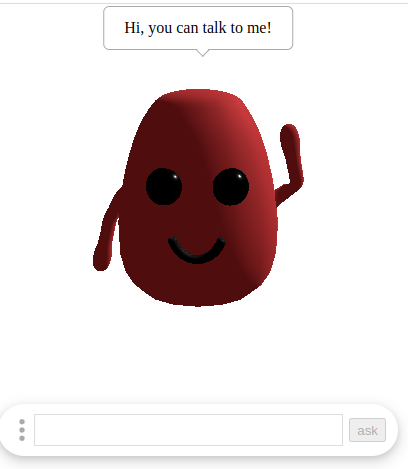

# assistant-robot
An assistant widget, have a 3D robot which can interact with user, have a simple LLM which can chat with user.   




## Why write this component
In my opinion, with the development of AI, an increasing number of UI will be replaced by a AI assistant.Because when AI become more and more clever, in most using case of a software, user can interact with software using natural language.So, I think in the future, most software will have a assistant widget to interact with user.

## Funtions
The main funtion of this widget is to load a 3D model to interact with user and to load a langauge model to communicate with user.    

This widget supports the customization of a 3D model for the robot.As long as this 3D model includes specific actions, it can be utilized within this component.So you can use suitable 3D model for you software.    

This widget have a face detect module. It can detect user's face's position so that the robot 3D model can look at the user.In the future, it can also detect the user's facial expression so that you can do more thing with users.

The widget defaults to using Google's [Mobile BERT](https://openreview.net/forum?id=SJxjVaNKwB) large language model as the conversational model.It is faster and smaller so that it can be run on browser. But it's performance is not particularly good and it also cannot fulfill specific business functionalities.So you should implement a class to fulfill specific business functionalities, and pass it to assistant-robot to interact with users.

## Install
```
npm install --save assistant-robot

// or

pnpm add assistant-robot

// or

yarn add assistant-robot

```

## See example or develop

```
git clone https://github.com/ymrdf/assistant-robot.git

cd assistant-robot

npm run dev
```

## Usage
See more in the [example](https://github.com/ymrdf/assistant-robot/tree/main/example)

```
import { Assistant, EAssistantEvent } from "assistant-robot";
import { MobileBertModel } from "assistant-robot/languageModels";

const assistant = new Assistant(modelContainer, {
  robotModel: {
    modelConfig: {
      position: [0, 0, 0],
      idleActionName: "idle-move",
    },
  },
  userDetector: {
    solutionPath: `/face_detection`,
  },
  operationBox: {
    operationList: [
      {
        key: "hello",
        text: "play hello",
      },
      {
        key: "dance",
        text: "dance",
      },
    ],
  },
  languageModel: {
    Model: MobileBertModel,
    modelUrl: "/mobile-bert/model.json",
    passage: `
    Nikola Tesla (/ˈtɛslə/;[2] Serbo-Croatian: [nǐkola têsla]; Serbian Cyrillic: Никола Тесла;[a] 10
      July 1856 – 7 January 1943) was a Serbian-American[4][5][6] inventor, electrical engineer, mechanical engineer,
      and futurist who is best known for his contributions to the design of the modern alternating current (AC)
      electricity supply system.[7] <br>

      Born and raised in the Austrian Empire, Tesla studied engineering and physics in the 1870s without receiving a
      degree, and gained practical experience in the early 1880s working in telephony and at Continental Edison in the
      new electric power industry. He emigrated in 1884 to the United States, where he would become a naturalized
      citizen. He worked for a short time at the Edison Machine Works in New York City before he struck out on his own.
      With the help of partners to finance and market his ideas, Tesla set up laboratories and companies in New York to
      develop a range of electrical and mechanical devices. His alternating current (AC) induction motor and related
      polyphase AC patents, licensed by Westinghouse Electric in 1888, earned him a considerable amount of money and
      became the cornerstone of the polyphase system which that company would eventually market.<br>
    `,
  },
});

assistant.addEventListener(EAssistantEvent.menuClick, (key) => {
  if (key === "hello") {
    assistant.assistantPlay("hello");
  } else if (key === "dance") {
    assistant.assistantPlay("idle-move");
  }
});
```

## Apis

### Assistant
```
import { Assistant } from "assistant-robot";
```
The main class of the assistant robot.After the class is instantiated, a fill funtion assistant robot will be show on the page.

#### constructor(container: Element, options: IAssistantRobotConfig<T>)   

container-the container html element which to render the assistant robot.      

options-the configs of this widget. 

#### ask(question: string):Promis(string)
Ask the assistant robot a question, parameter is the question to ask.It return the answer.

#### assistantSay(text: string):void
Make the assistant robot to say somthing. The text parameter is what you want the robot to say.

#### assistantPlay(name: string, config?: IActionConfig):void     
Make the robot play a action. For customized 3D model, you can let the 3D model play any actions by using this method.  
name- name of the action.It can be all action name of the 3D model.
config-config of the action. The IActionConfig interface is like this:
```
//config for the 3d model's action
interface IActionConfig {
  // If loop, default false
  loop?: boolean;
  // The degree of influence of this action (in the interval [0, 1]). Values between 0 (no impact) and 1 (full impact) can be used to blend between several actions. Default is 1.
  weight?: number;
  // Scaling factor for the time. A value of 0 causes the animation to pause. Negative values cause the animation to play backwards. Default is 1.
  timeScale?: number;
  // The number of repetitions of the action, default 1;
  repetitions?: number;
}
```

#### Event
Assistant have implemented the oberver patern, so you can use the following api to listen it's event.    

 - addEventListener(name: string, func: TEventListenFunc)- to add an event listener.
 - removeEventListener(name: string, func: TEventListenFunc)-to romove an event listener.

The events you can observe are:

```
enum EAssistantEvent {
  // language model loading completed
  languageModelLoaded = "languageModelLoaded",
  // user dectect module's status changed, status as parameter
  userDetectorStatusChange = USER_DETECTOR_STATUS_CHANGE_EVENT,
  // operation menu be clicked, menu key as parameter
  menuClick = "menuClick",
  // user asked something, question string as parameter
  ask = "ask",
  // the robot said something, a text as parameter
  say = "say",
}
```

### LanguageModel
```
import { LanguageModel } from "assistant-robot/languageModels";
```

The base class for class which you will implement to fulfill specific business functionalities. When you implement the class, you must run `loaded` method to change the status of the class and call onLoaded function to inform the assistant robot. And you must implement the `findAnswers` which can answer all kind of questions.

### MobileBertModel
```
import { MobileBertModel } from "assistant-robot/languageModels";
```
The default language model implementation to used in assistant robot.It used Google's [Mobile BERT](https://openreview.net/forum?id=SJxjVaNKwB) large language model as the conversational model.It is faster and smaller so that it can be run on browser. But it's performance is not particularly good. Besides the conversational function, it didn't implement any businesses functiones.

#### constructor({ passage, modelUrl })
 - passage- The content to extract answers from.
 - modelUrl -specifies custom url of the model. This is useful for area/countries that don't have access to the model hosted on GCP.

#### findAnswers(question: string):Promise<string>
Ask model question, it will return the answer.


## Configs
Assistant-robot support lot's of customization. You can customize it by change the config of the second parameter of the Assistant's construtor method.

### className
Add a class name to the container.So that user can override styles with CSS.

### languageModel

Configs for assistant robot's language model. It include a Model property. Model is the language model to implement bussiness functions. The default value is MobileBertModel. The rest properties of languageModel will give to the language model. 

### operationBox

Configs for assistant robot's operation part.It include the follow propertys:
|name|type|detail|default|
|---|---|---|---|
|hide|boolean|If the operation bar should be hidden.|false|
|perationBoxClassName|string|Add a class name to the operation bar's container tag.So that user can override styles with CSS.||
|operationList|Array|Items to add to the operation menu.|[]|

The operationList's item is like this:
```typescript
// User defined operation menu item
export interface IOperation {
  // key, to mark which item was clicked
  key: string;
  // text which be showed on the menu
  text: string;
  /**
   * To mark that is this item disabled,
   * we just add a `data-disabled` attribute to the menu item,
   * user should implement the funtion
   */
  disabled: boolean;
}
```

### robotModel
Configs for the robot's 3d model, and it's render.It include the follow propertys:
#### modelUrl: string
The 3d model of the robot's address, which was expected to be a glb/gltf file.

#### modelConfig 
Configs for the 3d model of the assistant robot.It is like this:

```typescript
// Configs for the 3d model of the assistant robot.
export interface IModelConfig {
  // model's position
  position: [number, number, number];
  // model's rotation
  rotation: [number, number, number];
  // model's hello action's name
  helloActionName: string;
  // model's idle action's name
  idleActionName: string;
  // what the assistant robot should say,when it was loaded.
  helloContent: string;
}

```

#### backgroundColor: number;
Background color of the scene;
#### backgroundAlpha: number;
Background's alpha,from 0 to 1.

#### camera
Config of the camera in the scene.It is like this:
```typescript
{
    // Camera frustum vertical field of view.
    fov: number;
    // Camera frustum near plane.
    near: number;
    // Camera frustum far plane
    far: number;
    // Camera's position in the scene
    position: [number, number, number];
    // A point which the camera face
    lookAt: [number, number, number];
  }
```
#### ambientLight
Config of the ambient light in the scene.the light globally illuminates all objects in the scene equally.
It is like this:
```typescript
{
    // Numeric value of the RGB component of the color.
    color: number;
    // Numeric value of the light's strength/intensity. Expects a `Float`.
    intensity: number;
  }
```

#### directionalLight
Config of the directional light in the scene.A light that gets emitted in a specific direction.
It's like this:
```typescript
{
    // Numeric value of the RGB component of the color.
    color: number;
    // Numeric value of the light's strength/intensity. Expects a `Float`.
    intensity: number;
    // the position of the light
    position: [number, number, number];
  }

```

### userDetector
Configs for the userDetect module.
#### solutionPath:string
The path to where the files of the face detect model are located.If your user can not get the public one, the files can be download from [there](https://github.com/ymrdf/assistant-robot/tree/main/example/public/face_detection)    

## TODO
- More actions of the default 3D model， especially the speak action of the 3D model
- Voice Chat
- Detect user's facial expressions, and emit an event
- Speech output

## Contributing

Any contribution will be welcomed.

## License
[MIT](./LICENSE)


